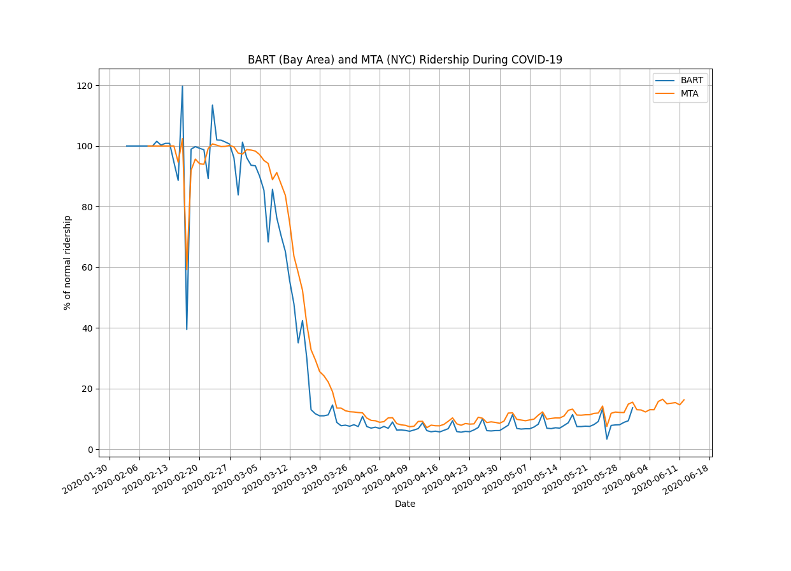

# Subway Ridership during COVID-19
Download and view subway ridership data for New York City's [MTA](https://new.mta.info/) and Bay Area's [BART](https://www.bart.gov/).



## Source

BART - Daily Station Exits (updated monthly): https://www.bart.gov/about/reports/ridership

MTA - Turnstile Data (updated weekly): http://web.mta.info/developers/turnstile.html

## Dependencies

You need Python 3.7+ with the following packages: numpy, pandas, requests, matplotlib (for plotting), xlrd (to read Excel file)

You can install all the dependencies by running the following:
```
pip install -r requirements.txt
```

## Usage

### Plot BART ridership
```
python bart_ridership.py
```

### Plot MTA ridership
```
python mta_ridership.py
```

### Plot combined ridership
```
python plot_ridership.py
```
