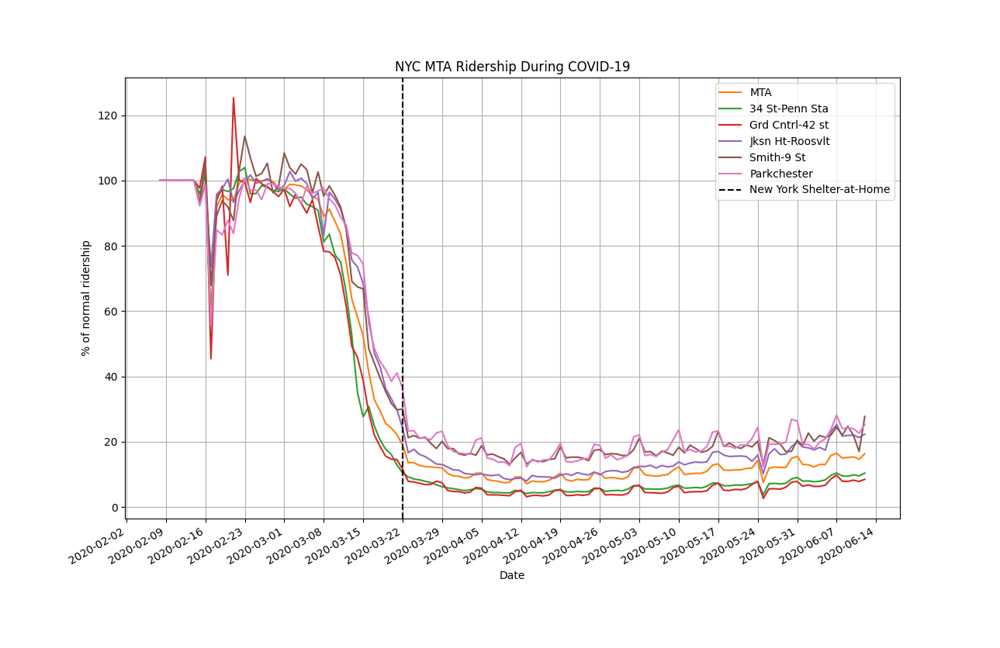

# Subway Ridership during COVID-19
Download and view subway ridership data for New York City's [MTA](https://new.mta.info/) and Bay Area's [BART](https://www.bart.gov/).




## Source

BART - Daily Station Exits (updated monthly): https://www.bart.gov/about/reports/ridership

MTA - Turnstile Data (updated weekly): http://web.mta.info/developers/turnstile.html

## Dependencies

You need Python 3.7+ with the following packages: numpy, pandas, requests, matplotlib (for plotting), xlrd (to read Excel file)

You can install all the dependencies by running the following:
```
pip install -r requirements.txt
```

## Usage

### Plot BART + MTA ridership
```
python plot_ridership.py
```
### Plot BART ridership only
```
python bart_ridership.py
```
### Plot MTA ridership only
```
python mta_ridership.py
```
### Plot BART ridership + select stations
```
python bart_ridership.py --station_abbr EM --station_abbr CC --station_abbr OW
```
Station abbreviations here: https://github.com/youyanggu/subway_ridership/blob/master/busiest_stations_bart.csv

### Plot MTA ridership + select stations
```
python mta_ridership.py --station_name 34 St-Penn Sta --station_name Grd Cntrl-42 st --station_name Jksn Ht-Roosvlt --station_name Smith-9 St --station_name Parkchester
```
Station names here: https://github.com/youyanggu/subway_ridership/blob/master/busiest_stations_mta.csv

### Change baseline date
By default, we use the week of February 1 as the baseline to compare future ridership. To use a different start date, pass in a `--start_date` flag:
```
python bart_ridership.py --start_date 2020-02-08
```
### Change baseline date
You can save the output of our ridership data by passing in the `--out_fname` flag. This will generate the file you see here: https://github.com/youyanggu/subway_ridership/blob/master/daily_bart_ridership.csv.
```
python bart_ridership.py --out_fname daily_bart_ridership.csv
```

## Busiest Stations

### BART

https://github.com/youyanggu/subway_ridership/blob/master/busiest_stations_bart.csv

### MTA

https://github.com/youyanggu/subway_ridership/blob/master/busiest_stations_mta.csv
